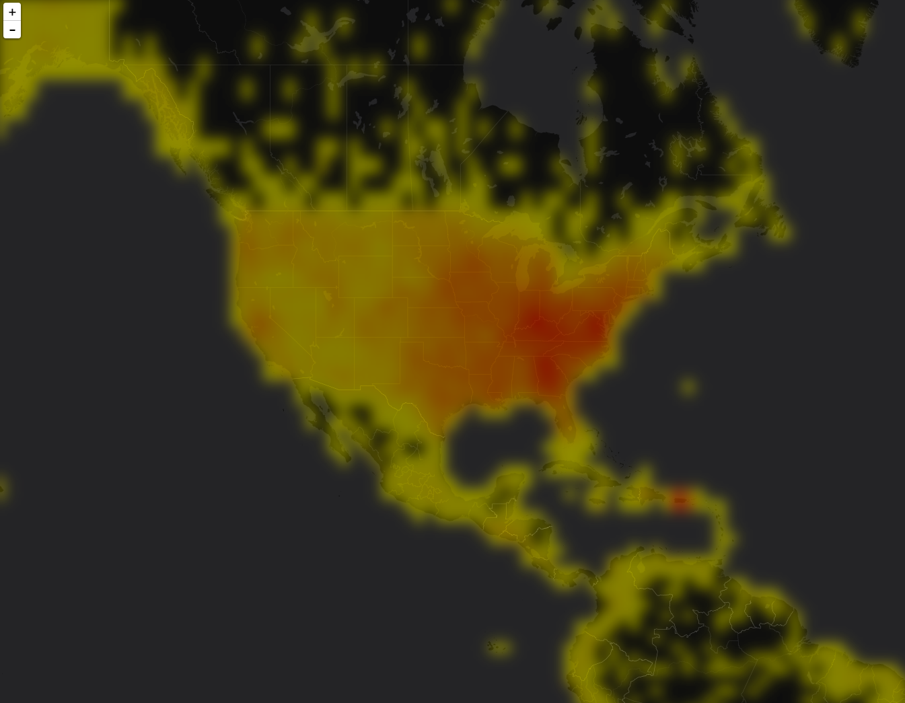

# Leaflet Solr Heatmap

This library contains a [Leaflet](http://leafletjs.com/) layer that renders a Solr heatmap.

## Usage

The library can be installed via bower:

    % bower install leaflet-solr-heatmap

Once installed simply include ``heatmap.js`` after the leaflet scripts:

    
    

And finally add it to the map.

    L.SolrHeatmapLayer('http://localhost:8983/solr/<core>', {
        field: 'geo'
    }).addTo(map);

See the [example](example.html) for a working example.

## Configuration

``SolrHeatmapLayer`` takes a number of configuration options:

| Name | Default | Description |
| -----|---------|-------------|
| field | ``geo`` | The Solr spatial field. Currently this must be an RPT field. |
| query | ``{q: '*:*'}`` | Object defining Solr query (q, fq, etc...). |
| colors | ``['ffff00', 'ff0000']`` | Two colors for the low and high intensity areas of the heatmap respectively.  Specified as 6 digit hex values. |
| blur | ``5`` | The radius in pixels of the blur filter to apply during heatmap rendering. |
| opacity | ``0.5`` | The opacity of the heatmap layer. |
| interp | ``lin`` | Interpolation method used to generate colors from intensity values. One of ``lin`` (linear), ``log`` (logarithmic), or ``exp`` (exponential).|

## Solr Heatmaps

Heatmap Faceting is documented in the Solr spatial [docs](https://cwiki.apache.org/confluence/display/solr/Spatial+Search).

## Background

The heatmap layer works by rendering the heatmap data directly using the browser 
[canvas](https://developer.mozilla.org/en-US/docs/Web/API/Canvas_API) api. This is a much more efficient approach than 
creating objects and adding them to a leaflet vector layer. The canvas layer infrastructure is provided by a 
[plugin](https://github.com/CartoDB/Leaflet.CanvasLayer) from CartoDB. 
